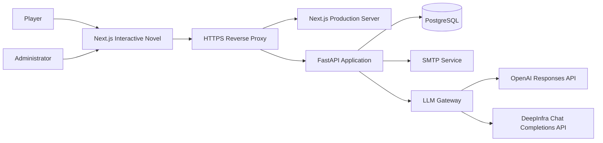
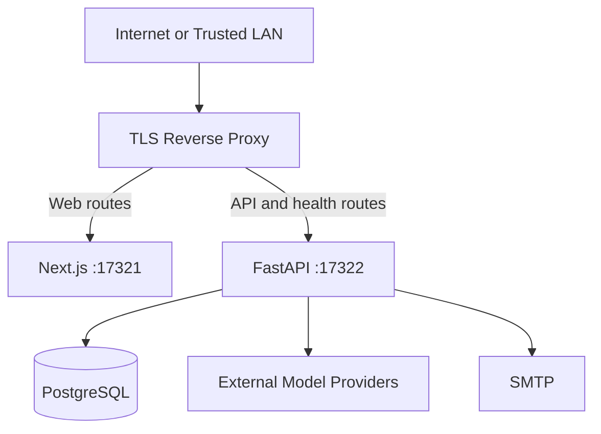
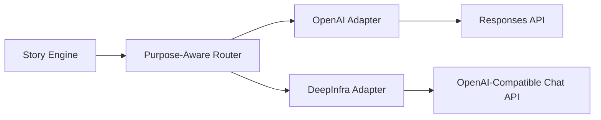
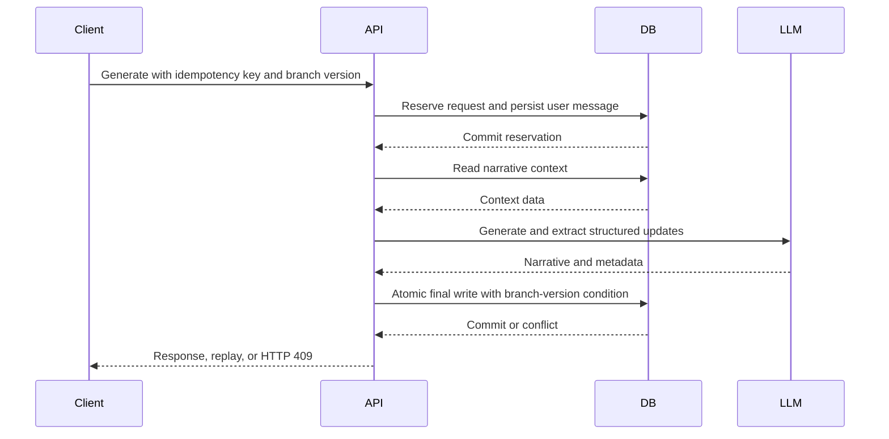

# Witscraft System Architecture

**Document status:** Production baseline

**Architecture version:** 3.15

**Last updated:** 17 August 2026

**System owner:** Witscraft Engineering

## 1. Purpose and Scope

Witscraft is a customizable AI-authored interactive fiction experience. The AI narrative engine acts as author and narrator; the user plays a selected character and directs the plot through actions and choices. It combines persistent narrative state, branching story management, selective long-term memory, configurable model routing, and account-level privacy controls in a single production-oriented application. It is not an authoring workbench or a tool aimed at professional writers.

This document describes the architecture implemented in the repository and identifies deliberate constraints and approved evolution paths. It is not a speculative target-state catalogue.

The architecture is guided by the following principles:

1. The application remains a modular monolith until scale or ownership boundaries justify service extraction.
2. The browser never receives model-provider credentials or direct database access.
3. PostgreSQL is the system of record for identity, narrative state, generation coordination, and audit metadata.
4. Model providers are replaceable infrastructure behind a provider-neutral gateway.
5. Deterministic application logic owns authorization, idempotency, state transitions, and persistence.
6. Expensive probabilistic operations are invoked only when they materially improve the user outcome.
7. Production releases are immutable with respect to schema: migrations are an explicit deployment step.

## 2. System Context



All browser traffic enters through the HTTPS reverse proxy. The reverse proxy routes application pages to Next.js and API paths to FastAPI. FastAPI is the sole trusted coordinator for application data and external model calls.

## 3. Deployment Topology

The current production topology uses one Next.js process, one FastAPI process, and one PostgreSQL database. The processes are supervised by the host operating system and exposed through a reverse proxy.



Production characteristics:

- The API trusts forwarded headers only from the local reverse proxy.
- CORS origins and allowed hosts are explicit allowlists.
- Authentication cookies are `Secure`, `HttpOnly`, and `SameSite=Lax`.
- Production secrets are supplied through process environment variables or `WITSCRAFT_SECRETS_FILE`.
- The production process does not read the development-only `env.md` compatibility file.
- Uvicorn receives a bounded graceful-shutdown interval and disposes the SQLAlchemy connection pool during application shutdown.

The current single-process rate limiter and model circuit breaker are intentional constraints. Both must move to shared infrastructure before horizontal API scaling is enabled.

## 4. Repository Structure

```text
Witscraft/
├── apps/
│   ├── api/
│   │   ├── app/
│   │   │   ├── db/                 # SQLAlchemy models and sessions
│   │   │   ├── llm/                # Provider adapters, routing, and call audit
│   │   │   ├── routers/            # HTTP API boundaries
│   │   │   ├── schemas/            # Pydantic request and response contracts
│   │   │   └── services/           # Narrative, auth, memory, export, and health logic
│   │   ├── migrations/              # Alembic revisions
│   │   ├── tests/                   # Unit and PostgreSQL integration tests
│   │   ├── pyproject.toml
│   │   └── uv.lock
│   └── web/
│       ├── app/                     # Workspace and separate administrator route
│       ├── lib/                     # Typed API client and shared types
│       ├── package.json
│       └── package-lock.json
├── docs/                            # Operational and policy documentation
├── scripts/                         # Development and verification utilities
└── .github/workflows/               # Automated quality and security gates
```

Machine-specific deployment files and live secrets are intentionally excluded from version control.

## 5. Logical Application Architecture

### 5.1 Web Application

The Next.js application provides the interactive novel experience, authentication views, story and branch selection, character and world customization, model routing settings, weekly quota visibility, account data export, and account deletion controls. The AI remains responsible for prose generation and narrative continuation; the player supplies character actions, choices, and desired direction. A separate `/admin` route provides searchable, role-filtered, paginated account-level usage governance and bounded reset audit history without exposing narrative content.

The current interface is implemented as a cohesive App Router workspace rather than a collection of independently deployed frontends. It communicates exclusively with the FastAPI API through the typed client in `apps/web/lib/api.ts`.

Client responsibilities include:

- rendering server-owned narrative and account state;
- generating one idempotency key for each user generation action;
- preserving the key when replaying the same HTTP request;
- sending the latest branch version with generation requests;
- consuming Server-Sent Events for streamed generation;
- presenting recoverable conflicts rather than silently overwriting state; and
- never persisting provider credentials in browser storage.

### 5.2 API Routers

FastAPI routers define six principal API areas:

| Router | Responsibility |
| --- | --- |
| `auth` | Registration, login, verification, password reset, sessions, account export, and deletion |
| `workspace` | Stories, branches, worlds, characters, memories, canon facts, preferences, summaries, and exports |
| `chat` | Context preview, regular generation, and streamed generation |
| `providers` | Model catalogue, user routing preferences, and provider health tests |
| `quota` | Authenticated personal weekly usage and reset boundary |
| `admin` | Role-protected account usage overview and global quota reset |

Routers perform protocol validation and authorization entry checks. Domain coordination remains in services so persistence and generation rules are not duplicated across endpoints.

### 5.3 Story Engine

The Story Engine is the primary narrative orchestrator. It coordinates context assembly, model execution, state extraction, memory preparation, consistency handling, and atomic persistence.

The engine does not grant model output authority over database identity, authorization, branch selection, or transaction control. Structured model output is validated before it can affect stored state.

Consistency checks are deterministic local rules over canon, scene state, character constraints, and world rules. Their evidence includes error and warning counts plus the highest severity. Warnings never call a provider. In automatic mode, a revision call is permitted only when a local rule emits `severity=error`; the revised prose is accepted only if a second local pass reduces the error count to zero. Provider failure or a surviving error preserves the original AI-authored response and records the reason. Manual mode exposes the same evidence for a player decision without automatic revision spend.

### 5.4 Context and Prompt Services

Context construction is separated into deterministic stages:

1. Load the authorized story, branch, world, character, and current state.
2. Load recent messages, summaries, canon facts, preferences, and eligible memories.
3. Allocate a shared section pool dynamically using conservative token estimation.
4. Deduplicate current input and previously represented information.
5. Render a provider-neutral message sequence.

The current user message appears exactly once as the final user message. Context sections share a deterministic 5,460-token ceiling beneath a 9,000-token input target and fixed render reserve. The allocator protects minimum continuity budgets, redistributes unused capacity up to per-section maxima, and shrinks the pool for a large player message. World, character, state, canon, preferences, custom instructions, cumulative summary, memories, and recent messages all enforce the resulting allocation. Preview evidence includes estimator identity, demand, allocation, selected tokens, authoritative source, dropped counts, and truncation reason for each section.

Session summaries are branch-local cumulative checkpoints. Generation is currently an explicit player operation rather than a per-turn side effect. A new summary receives the previous cumulative summary and only messages beyond its deterministic `(created_at, id)` coverage boundary, then stores a complete replacement. `parent_summary_id`, the full from/to message range, prompt version, actual provider/model, trigger, cumulative message count, and source-token estimate make lineage and cost auditable. A branch clone remaps summary parents and message boundaries; a request with no new messages is rejected before model execution.

### 5.5 LLM Gateway

The LLM Gateway provides one application-facing contract across OpenAI and DeepInfra.



The gateway owns provider-specific parameter translation, purpose-level route resolution, input and output budgets, timeouts, bounded retries, error classification, purpose-specific fallback selection, process-local circuit breaking, streaming normalization, and model-call audit metadata. For every primary narrative or auxiliary model task, it resolves a validated user route first and otherwise selects the registered system default. Unknown purposes, unknown models, and persisted provider/model mismatches are ignored rather than forwarded to a provider.

The browser submits a purpose and never independently selects the effective provider/model for story generation. The provider catalogue exposes the resolved route, source, and effective budgets for every purpose, while context preview includes the selected narrative route. Optional legacy route hints must match the backend result or the request is rejected before story mutation. Provider credentials and infrastructure base URLs are never part of this browser contract.

The registry partitions model work into five explicit roles: AI author (`normal_chat` and `critical_story_generation`), structured extraction (`state_update` and `event_extraction`), continuity revision (`consistency_check`), context summary (`summary_generation`), and memory embedding. The first four remain independently configurable purpose-route groups even when their approved defaults currently resolve to the same model. Embedding is deployment-controlled and versioned outside the narrative gateway; a model or version change requires a controlled re-indexing workflow. The provider catalogue exposes role metadata and non-sensitive embedding identity so clients explain this boundary without inferring it.

Purpose-route updates acquire an account row lock, replace the complete route set, and append an immutable before/after audit snapshot in one transaction. A no-op creates no history row. Undo restores the previous effective snapshot and appends a linked undo event instead of deleting history, so every active configuration remains explainable and a rollback can itself be reversed. History queries are tenant-scoped, bounded, exported with the account, and deleted by the account foreign-key cascade.

Provider SDK retries are disabled. Authentication failures, invalid parameters, content rejection, and user cancellation are not retried. Streaming may retry or select a fallback only before the first visible content chunk.

### 5.6 Authentication and Authorization

Authentication uses server-side sessions. Only a one-way session-token hash is persisted. Passwords are stored using the configured password hashing implementation, and action tokens are stored in hashed form.

Every user-owned query is scoped by the authenticated user identifier. Story, branch, world, character, memory, canon fact, workspace, and export authorization boundaries are covered by PostgreSQL integration tests.

The persisted `User.is_admin` flag is the administrator role source of truth. Administrative dependencies reload the current user from PostgreSQL and reject standard accounts with HTTP `403`; a client-provided role is never trusted. Role assignment and revocation are controlled host operations with no public self-promotion endpoint. Administrators may view account identity and aggregate quota usage and may reset the global quota window. They do not receive cross-user access to stories, messages, memories, exports, passwords, sessions, provider credentials, prompts, or model responses.

### 5.7 Health and Lifecycle Services

Health probes have distinct semantics:

| Endpoint | Meaning | External cost |
| --- | --- | --- |
| `/health/live` | The API process and event loop can respond | None |
| `/health/ready` | Required configuration, database connectivity, and migration revision are valid | One lightweight database check |
| `/health` | Backward-compatible basic health endpoint | None |

Readiness never calls a model or SMTP provider. A database failure, timeout, missing required configuration, missing Alembic version table, or revision mismatch returns HTTP `503` without exposing an internal exception.

## 6. Data Architecture

PostgreSQL is the authoritative store. The principal entity groups are:

| Group | Entities |
| --- | --- |
| Identity and roles | `User`, `AuthCredential`, `AuthSession`, `AuthActionToken`, `AuthLoginThrottle` |
| Narrative ownership | `World`, `Character`, `Story`, `StoryBranch` |
| Narrative history | `Message`, `PlotEvent`, `StoryStateSnapshot`, `StorySummary` |
| Long-term context | `MemoryItem`, `CanonFact`, `UserPreference` |
| Generation control | `GenerationRequest` and branch version fields |
| Model operations | `UserModelRoute`, `ModelHealthCheck`, `ModelCall` |
| Usage governance | `QuotaResetEvent` |

UUIDs are used for externally referenced entities. Foreign keys and database cascades enforce ownership lifecycles, while application-level checks enforce user authorization.

Migration `0017` installs pgvector and adds fixed `vector(1024)` storage for current long-term-memory embeddings. Provider calls explicitly request 1,024 dimensions and reject count, dimension, or finite-value violations before persistence. Migration `0014` metadata continues to bind provider-qualified model, dimension, operator-controlled version, normalized content hash, and UTC generation time. Dimension-compatible JSONB values are moved to the vector column; incompatible legacy values remain in JSONB until controlled re-embedding. PostgreSQL computes exact cosine similarity only for authorized, active story/branch candidates with compatible metadata. Legacy memories remain eligible for structured ranking but are never compared across vector spaces.

### 6.1 Query and Index Strategy

Indexes follow observed application query shapes rather than individual columns in isolation.
Composite indexes cover tenant ownership, branch-local chronology, and latest-record retrieval.
Partial indexes limit write and storage overhead for active memory/canon ranking and successful
story-generation audit lookup. Supporting foreign-key indexes protect message cleanup and branch
deletion from repeated child-table scans.

Migration `0012` creates these indexes concurrently to avoid long exclusive table locks during a
production upgrade. A rollback-only benchmark inserts 230,000 synthetic rows into the actual
application tables and verifies critical reads with `EXPLAIN ANALYZE`; all covered reads use
bounded index scans at the current revision. Methodology and measured results are maintained in
`docs/database-performance.md`.

### 6.2 Backup and Recovery

The production host creates one logical PostgreSQL backup each day. `pg_dump` custom output is
compressed with Zstandard and streamed directly into a CMS AES-256-GCM envelope. The backup task
holds only a public recipient certificate; restoration requires a separately controlled private key
and passphrase. Each artifact has a SHA-256 transport checksum and a non-sensitive manifest that
records schema and application revisions.

Local encrypted artifacts are retained for 7 days. The tooling supports a 35-day off-site replica,
but external transfer remains disabled until the owner approves a destination and independent key
escrow. This limitation means total host loss is not yet covered by the stated recovery objectives.

Restoration always targets a new isolated database first. The restore gate validates checksum,
authenticated decryption, dump catalogue, Alembic revision, and core record counts before an
isolated API performs login, workspace read, and dry-run generation smoke tests. Detailed operating
procedures and drill evidence are maintained in `docs/backup-recovery.md`.

## 7. Generation and Transaction Model

Generation is divided into explicit phases to avoid holding a database write transaction while waiting for an external model.



The final transaction commits the assistant message, state snapshot, memories, canon facts, branch version, and completed generation response together. A branch-version conflict rolls back the complete final write.

Streaming partial content is checkpointed immediately and then at bounded time or character intervals. Cancellation preserves the latest stable partial and records a complete cancellation reason. Cleanup runs inside a narrowly shielded AnyIO cancellation scope so repeated disconnect cancellation cannot interrupt the rollback, partial checkpoint, or generation-status transition; model execution itself is never shielded.

## 8. Idempotency and Concurrency

Each generation action has a durable `(user_id, idempotency_key)` identity.

- A completed request replays its stored response without another model call.
- Reuse with a different payload is rejected.
- Processing, failed, or cancelled requests do not start a duplicate generation.
- Only one generation may be processing for a branch.
- Stale generation leases are failed after the configured interval.
- Optimistic branch versions prevent stale browser tabs from overwriting newer narrative state.

These controls protect both narrative consistency and model spend.

## 9. Memory, Embeddings, and Cost Control

Embedding is selective. The system does not embed every conversational turn by default.

Embeddings are appropriate when content is accepted into long-term memory or when semantic retrieval is required. They are skipped when there are no eligible memories, when deterministic recent-context selection is sufficient, or when an identical content hash can reuse prior work.

New long-term-memory candidates pass a deterministic admission boundary before embedding. Consequential event markers and references to known character or inventory entities contribute to an importance score; low-value transient actions are rejected. Normalized near-duplicate comparison suppresses paraphrases of recent branch memories, while disjoint known entity sets preserve otherwise similar events involving different characters. Accepted memories persist their computed importance and entity tags for ranking and operator inspection. The filter adds no model calls.

A repeated extracted event refreshes the existing row's importance, entity tags, and recency without changing its content or embedding. Manual importance-only edits also preserve the vector. Manual content edits reject exact active duplicates before provider work, clear content-derived entity tags, and replace the vector and compatibility metadata atomically with the new content. A failed embedding cannot persist a content/vector mismatch.

Retrieval is hybrid within the authorized story and branch candidate set. Keyword n-grams, entity-tag overlap, importance, and relative update time are always available. Compatible vector similarity becomes an additional signal only above the deployment-configurable `MEMORY_VECTOR_SEARCH_MIN_ITEMS` threshold. Before creating a query embedding, the engine verifies that at least one candidate has the current provider-qualified model, dimension, and version; legacy-only sets therefore remain useful without incurring an unusable embedding call. Exact cosine values for fixed pgvector rows are calculated by PostgreSQL under the same story, branch, active-row, model, dimension, and version predicates, then combined with deterministic structured signals in the application. Compatible JSONB transition/test vectors keep an isolated calculation; non-current legacy vectors receive structured signals only.

`TurnContext` owns state-snapshot, memory-retrieval, and query-embedding reuse within one audited request. It is reset at the start of every turn and is never shared across users or concurrent requests. State and relationship assembly derive from one cached snapshot read, while repeated retrieval with the same story, branch, and normalized query reuses an immutable result. The first unique embedding query records provider usage; a direct embedding-cache hit records zero billable tokens, zero cost, dimensions, and estimated avoided input tokens. This makes the optimization measurable without inflating quota consumption or billing reconciliation.

Every model purpose has a central route, maximum input budget, default output budget, and hard output limit. The gateway applies these policies before provider execution to primary, auxiliary, fallback, streaming, and non-streaming requests. Saved user routes take precedence over system defaults and are loaded for narrative generation, state and event extraction, choice generation, consistency checks, planning interviews, story drafts, and summaries. The effective output ceiling is the lower of the purpose limit and model capability. Oversized input is rejected before provider traffic. In addition, the shared turn auditor reserves one slot for each real provider request and stops retries, fallbacks, auxiliary calls, and external embeddings when the per-turn ceiling is reached. The current policy and values are maintained in `docs/model-cost-controls.md`.

The exact-database contract includes a fixed eight-case Recall@8 and designated error-recall corpus, plus 24 uncached retrievals against 10,000 active rows. CI records end-to-end p95 latency as a regression guard. This remains synthetic contract evidence; HNSW stays disabled until production tenant shape, concurrency, cold-cache behavior, and live-provider embedding captures justify an activation threshold and parameters. Legacy or superseded vectors require an asynchronous, retryable re-embedding workflow before their JSONB compatibility lane can be removed.

Multi-model routing is supported by purpose. A multi-agent architecture is not the default because narrative generation is primarily a coordinated state-transition workflow, not an open-ended autonomous task graph. Additional agents are justified only when an independently measurable task, such as evaluation or complex planning, produces sufficient quality improvement to offset latency, cost, and failure complexity.

### 9.1 Weekly Usage Governance

Standard users receive a configurable weekly account allowance through `USER_WEEKLY_TOKEN_QUOTA`, with a default of 500,000 tokens, plus an independent per-novel ceiling through `STORY_WEEKLY_TOKEN_QUOTA`, with a default of 250,000 tokens. The natural period is Monday `00:00 UTC` through the following Monday. Successful external LLM and embedding audit rows contribute their recorded input and output tokens; deterministic local and dry-run operations do not consume either allowance.

The provider-neutral gateway performs account and, for an active novel, story preflight checks using estimated input plus maximum output before contacting a provider. Rejection returns HTTP `429`, an explicit `account` or `story` scope, and the next reset boundary. Administrators are exempt from both allowances.

At the configurable soft threshold, 80% by default, the API marks the quota snapshot for a visible workspace warning while preserving the user's selected route. At the hard threshold, preflight blocks additional spend. The independent per-turn external-call ceiling defaults to 8 and bounds retry or orchestration amplification even when token estimates remain below the weekly allowance.

A manual global reset creates an append-only `QuotaResetEvent`; historical `ModelCall` records remain intact. The latest reset within the current calendar week becomes the effective period start. The administrator overview separates global metrics from the bounded account list: global counts and token usage retain tenant-wide meaning, while search, role filters, and pagination affect only the returned user page. Per-page usage is read through a grouped aggregate query, and the latest 10 reset events provide operator, reason, and effective-time auditability. None of these queries join narrative content.

This is a preflight and reconciliation design rather than a reservation ledger. The single-process deployment can admit simultaneous requests that together exceed the remaining allowance by a bounded amount. Strict multi-worker enforcement requires durable token reservations before horizontal scaling.

## 10. Security and Privacy Boundaries

Production security controls include:

- fail-fast validation of database, provider, SMTP, HTTPS, cookie, CORS, and host configuration;
- explicit trusted-host and browser-origin validation;
- CSRF checks for unsafe browser requests;
- category-specific sliding-window rate limits;
- backend-enforced administrator role checks and a separate limit for global quota reset;
- secure server-side sessions;
- structured log redaction for credentials, cookies, prompts, and sensitive query values;
- metadata-only model-call auditing;
- disabled production API documentation and debug exception output;
- disabled browser production sourcemaps and framework identification headers; and
- offline full-history secret scanning in CI.

Account export excludes password hashes, token hashes, provider secrets, SMTP credentials, and raw embedding vectors. Account deletion requires an active session, the current password, and an exact confirmation phrase before associated user data is removed.

Detailed data handling rules are defined in `docs/data-privacy.md`. Automated security gates are defined in `docs/security-checks.md`.

## 11. Model Audit and Observability

Every LLM and embedding attempt can record the provider, model, request and turn identifiers, purpose, attempt number, status, token counts, latency, optional versioned cost estimate, and sanitized error category.

Prompt and response text are not stored in `ModelCall`. Request identifiers provide correlation across application and access logs without requiring request-body logging.

The current implementation uses structured application logs and PostgreSQL audit records. OpenTelemetry-compatible traces, external metrics, and alerting remain planned operational enhancements.

## 12. Migration and Release Contract

Alembic is the only production schema migration mechanism. Revision `0013` adds administrator roles, append-only quota reset events, and a user/time model-call index for weekly accounting. Revision `0014` adds versioned embedding compatibility metadata and a content-hash lookup index for long-term memories. Revision `0017` installs pgvector, adds fixed-dimension vector storage, and preserves a reversible legacy JSONB compatibility path.

The release order is:

1. Install dependencies from committed lock files.
2. Run automated tests and security gates.
3. Build the production frontend.
4. Run `alembic upgrade head` as an explicit deployment step.
5. Start or restart the application processes.
6. Require `/health/ready` to return HTTP `200`.
7. Run authenticated smoke tests and observe logs before completing the release.

`scripts/release-preflight.sh` implements the reproducible local quality and security gate. After
the production frontend build, it creates a non-sensitive JSON manifest binding the full Git
revision to the Alembic heads, dependency-lock SHA-256 hashes, and Next.js build ID. Deployment
addresses and credentials are runtime inputs and are never written to the manifest. The
non-mutating `scripts/smoke-release.py` gate requires liveness, readiness, and both deployed
migration revision sets to match that manifest before a release can be accepted.

Application startup does not call `create_all`, seed data, or `alembic upgrade`. Readiness rejects a deployment whose database revision does not match the migration head shipped with the application.

On `SIGTERM`, the process server stops accepting new work, waits up to the configured graceful interval for in-flight requests, and then closes the SQLAlchemy connection pool. Long-running generation remains bounded by the configured overall model timeout.

## 13. Quality Gates

For every pull request and push to `main`, GitHub Actions provisions PostgreSQL 17 with pinned pgvector 0.8.6 support. It proves the `0017` compatible-vector backfill and downgrade restoration on synthetic data, returns the database to migration head, rejects ORM-to-migration drift, and runs the full backend test suite. The same workflow runs Ruff, TypeScript type checking, ESLint, reproducible production builds, dependency vulnerability audits, full-history offline secret scanning, and production browser-artifact inspection. External model traffic is disabled in CI.

Database authorization and lifecycle behavior use real PostgreSQL integration tests. The main API journey logs in through a real session cookie, creates an interactive novel, performs regular and SSE dry-run generation, cancels a blocked stream and verifies its durable checkpoint, regenerates a reply, creates and activates a branch, and exports the narrative. A separate Playwright gate runs the production client in Chromium with deterministic API fixtures and verifies login UI, workspace hydration, player direction submission, SSE consumption, narrative rendering, and the final synchronized story state. Provider adapters use deterministic fake-client contracts that exercise OpenAI Responses and DeepInfra Chat Completions parameter mapping, structured output options, token usage, stream filtering, split timeout configuration, disabled SDK retries, and exception propagation. Gateway tests separately prove transient and permanent HTTP status classification. Controlled live validation remains optional when API expenditure is explicitly permitted; CI never requires provider credentials.

The structured-state route has an additional versioned evaluation gate. CI replays synthetic recorded responses through the production parser and grounding path over a fixed anonymized corpus, calculates parse success, scalar accuracy, collection and relationship F1, critical invariant pass rate, and accepted hallucination rate, and validates that the registered default matches its route approval. Synthetic evidence verifies the machinery but cannot approve a new provider model. A replacement default requires a complete provider capture bound to the corpus hash and prompt version; the legacy exception is pinned to the exact pre-evaluation default.

A successful workflow is required release evidence. CI also proves that a clean checkout can create the release manifest after the production build. Branch protection and the deployment procedure must require that result; CI does not replace staging validation, authenticated smoke tests, or post-deployment observation.

## 14. Current Constraints and Approved Evolution

The following constraints are known and accepted for the current deployment:

- The API runs as one process; rate-limit and circuit-breaker state are process-local.
- Long-running jobs execute within request orchestration rather than a durable worker queue.
- Legacy embeddings with non-current dimensions remain in JSONB pending a controlled background re-embedding workflow.
- Daily encrypted local backup and application-level restoration drills are operational; approved off-site replication and independent recovery-key escrow remain P0 work.
- A production-equivalent staging environment has not yet been established.
- Metrics, tracing, and alerting are not yet connected to a dedicated observability platform.
- Database query plans are benchmarked locally, but production slow-query telemetry and tenant-skew analysis are not yet available.
- Weekly quotas use provider-call preflight checks without durable concurrent token reservations.

Evolution should occur in this order:

1. Complete backup, restoration, staging, and release automation.
2. Add browser end-to-end coverage and production-equivalent staging validation to the existing CI baseline.
3. Add approved live-provider captures and production tenant/concurrency latency evidence before enabling HNSW.
4. Add durable background jobs where retries and operational visibility require them.
5. Move coordination state to shared infrastructure before adding API replicas.
6. Add specialist models or agents only after evaluation data demonstrates a net quality benefit.

## 15. Architecture Decision Summary

| Decision | Rationale |
| --- | --- |
| Modular monolith | Preserves transactional clarity and reduces operational complexity at the current scale |
| PostgreSQL system of record | Provides relational integrity, transactional generation control, and a path to pgvector |
| Provider-neutral LLM Gateway | Isolates provider parameter, streaming, retry, and error differences |
| Explicit generation ledger | Prevents duplicate narrative writes and duplicate model spend |
| Selective embeddings | Controls cost and avoids low-value vector work on every turn |
| Purpose-level gateway budgets | Bounds input, output, quota preflight, and fallback spend for every model task |
| Request-scoped context cache | Reuses snapshot, retrieval, and audited embedding work without crossing tenant or turn boundaries |
| Soft weekly warning and hard turn ceiling | Warns before weekly exhaustion and stops abnormal provider-call amplification |
| Fake-client provider contracts | Detects SDK and provider protocol regressions without credentials, network variance, or model spend |
| Backend-owned roles and weekly quotas | Enforces least privilege and gives users a predictable spend boundary |
| Bounded administrator account queries | Preserves global metric meaning while preventing unbounded account payloads |
| Single orchestrator by default | Keeps authorization and state transitions deterministic and observable |
| Explicit Alembic deployment step | Prevents application startup from mutating production schema |
| Separate liveness and readiness | Distinguishes process availability from dependency and migration safety |
| Workload-shaped PostgreSQL indexes | Accelerates branch and ownership reads while partial indexes constrain write amplification |
| Public-key encrypted logical backups | Keeps decryption material out of the unattended backup process and supports isolated recovery drills |
| PostgreSQL-backed CI migration gate | Proves an empty database can reach migration head and rejects unversioned schema changes before release |
| Offline secret verification | Prevents suspected credentials from being transmitted to third parties |

This architecture is the production baseline for subsequent implementation and operational planning.
