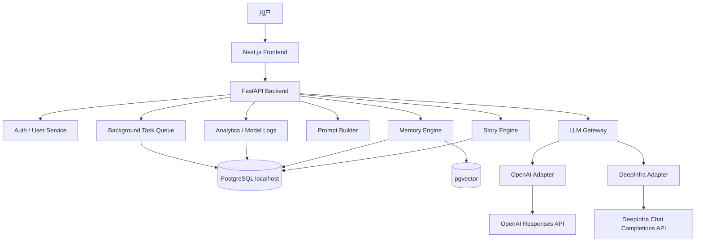
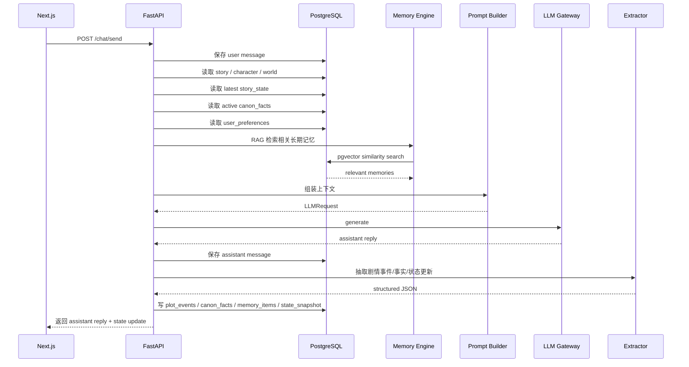
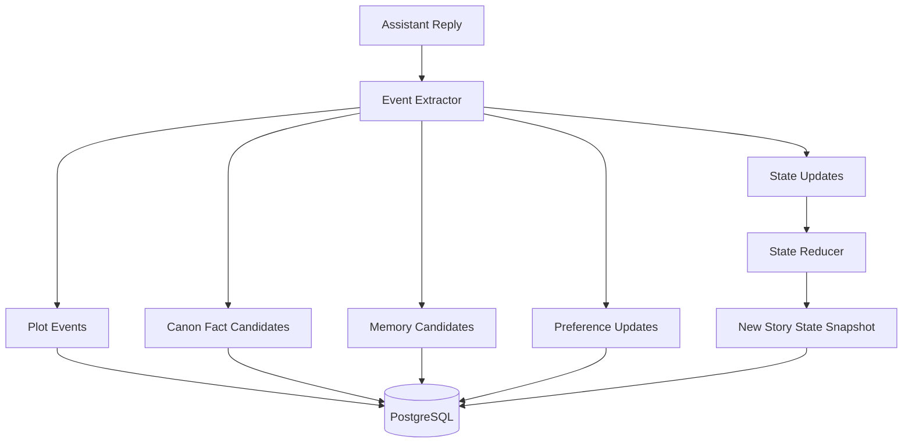

下面是我建议的**完整系统架构 v1**。
它的核心思想是：

> **Next.js 负责交互，FastAPI 负责编排，PostgreSQL 负责结构化数据 + 向量记忆，LLM Gateway 负责屏蔽 OpenAI / DeepInfra 参数差异，Story Engine 负责剧情连续性。**

---

# 1. 总体架构



OpenAI GPT-5.5 官方模型页显示它支持 `v1/chat/completions`、`v1/responses` 和 `v1/realtime`，并且有大上下文窗口和 `reasoning.effort` 控制，因此你这边建议优先把 OpenAI adapter 写成 Responses API 版本。([OpenAI Developers][1])
DeepInfra 官方文档说明它提供 OpenAI-compatible Chat Completions API，核心做法是改 `base_url`、`api_key` 和 `model`，endpoint 是 `https://api.deepinfra.com/v1/openai`，但它也提醒不保证 100% 兼容所有 OpenAI 参数，所以必须单独写 adapter。([DeepInfra][2])

---

# 2. 推荐技术栈

| 层级           | 技术                                              |
| ------------ | ----------------------------------------------- |
| 前端           | React + Next.js + TypeScript                    |
| 后端           | Python 3.12 + uv + FastAPI                      |
| 数据库          | localhost PostgreSQL                            |
| ORM          | SQLAlchemy 2.0 async                            |
| Migration    | Alembic                                         |
| 向量数据库        | PostgreSQL + pgvector                           |
| 模型 SDK       | openai Python SDK                               |
| OpenAI 调用    | Responses API                                   |
| DeepInfra 调用 | OpenAI-compatible Chat Completions              |
| 流式输出         | SSE，后续可升级 WebSocket                             |
| 后台任务         | MVP 用 FastAPI BackgroundTasks，后续 Celery / Redis |
| 日志           | PostgreSQL 先存，后续接 OpenTelemetry / Langfuse      |

pgvector 适合你的 MVP，因为它可以直接在 PostgreSQL 里存向量，支持 exact / approximate nearest neighbor search，也支持 L2、inner product、cosine 等距离。([GitHub][3]) 后续数据量上来后，可以给 embedding 列加 HNSW 索引；pgvector 文档说明 HNSW 通常有更好的 speed-recall tradeoff，但构建更慢、占用更多内存。([GitHub][3])

---

# 3. 项目目录结构

```text
ai-novel/
├── apps/
│   ├── web/                         # Next.js 前端
│   │   ├── app/
│   │   │   ├── page.tsx
│   │   │   ├── stories/page.tsx
│   │   │   ├── stories/[storyId]/page.tsx
│   │   │   ├── characters/page.tsx
│   │   │   ├── characters/[characterId]/page.tsx
│   │   │   ├── worlds/page.tsx
│   │   │   └── settings/page.tsx
│   │   ├── components/
│   │   │   ├── ChatWindow.tsx
│   │   │   ├── MessageList.tsx
│   │   │   ├── CharacterEditor.tsx
│   │   │   ├── WorldEditor.tsx
│   │   │   ├── StoryStatePanel.tsx
│   │   │   ├── MemoryPanel.tsx
│   │   │   └── ProviderSelector.tsx
│   │   ├── lib/
│   │   │   ├── api.ts
│   │   │   └── types.ts
│   │   └── package.json
│   │
│   └── api/                         # Python 后端
│       ├── app/
│       │   ├── main.py
│       │   ├── config.py
│       │   ├── db/
│       │   │   ├── session.py
│       │   │   ├── models.py
│       │   │   └── repositories/
│       │   ├── routers/
│       │   │   ├── auth.py
│       │   │   ├── users.py
│       │   │   ├── characters.py
│       │   │   ├── worlds.py
│       │   │   ├── stories.py
│       │   │   ├── chat.py
│       │   │   ├── memories.py
│       │   │   └── providers.py
│       │   ├── services/
│       │   │   ├── story_engine.py
│       │   │   ├── memory_engine.py
│       │   │   ├── prompt_builder.py
│       │   │   ├── event_extractor.py
│       │   │   ├── state_reducer.py
│       │   │   ├── consistency_checker.py
│       │   │   ├── preference_service.py
│       │   │   └── summarizer.py
│       │   ├── llm/
│       │   │   ├── base.py
│       │   │   ├── router.py
│       │   │   ├── openai_adapter.py
│       │   │   └── deepinfra_adapter.py
│       │   ├── schemas/
│       │   │   ├── chat.py
│       │   │   ├── character.py
│       │   │   ├── world.py
│       │   │   ├── story.py
│       │   │   ├── memory.py
│       │   │   └── llm.py
│       │   └── tasks/
│       │       ├── embedding_tasks.py
│       │       ├── summary_tasks.py
│       │       └── cleanup_tasks.py
│       ├── alembic/
│       ├── pyproject.toml
│       ├── uv.lock
│       └── .env
│
├── docker-compose.yml               # 可选，后续方便本地 PostgreSQL
└── README.md
```

---

# 4. 前端架构

前端不要直接访问 OpenAI / DeepInfra。
前端只调用你自己的 FastAPI。

## 主要页面

```text
/                         首页
/stories                  故事列表
/stories/[storyId]        主聊天页
/characters               角色列表
/characters/[id]          角色编辑
/worlds                   世界观列表
/worlds/[id]              世界观编辑
/settings/models          模型服务商配置
/settings/preferences     用户偏好
```

## 主聊天页应该包含

```text
左侧：
- 故事列表
- 当前世界观
- 当前角色

中间：
- 对话窗口
- 流式输出
- 用户输入框
- 重新生成 / 继续 / 改写 / 分支

右侧：
- 当前剧情状态
- 重要事实
- 已召回记忆
- 用户偏好
- 模型调用信息
```

这个右侧面板很重要。
因为你的产品不是普通聊天，而是**持续剧情系统**，用户最好能看到：

```text
当前地点
当前时间
当前目标
角色关系
主角物品
开放伏笔
已确认事实
```

这样不仅方便 debug，也能让用户信任 AI 没有忘剧情。

---

# 5. 后端核心模块

后端可以先做成**单体模块化架构**，不要一开始拆微服务。

```text
FastAPI Backend
├── API Routers
├── Story Engine
├── Memory Engine
├── Prompt Builder
├── LLM Gateway
├── Event Extractor
├── State Reducer
├── Consistency Checker
├── Preference Service
└── Logging / Evaluation
```

## 5.1 Story Engine

负责剧情主流程。

它不直接调用模型，而是协调其他服务：

```text
1. 接收用户输入
2. 保存 user message
3. 读取角色、世界观、当前剧情状态
4. 调用 Memory Engine 检索长期记忆
5. 调用 Prompt Builder 组装上下文
6. 调用 LLM Gateway 生成回复
7. 保存 assistant message
8. 调用 Event Extractor 抽取事件
9. 调用 State Reducer 更新状态
10. 写入记忆、事实、剧情事件
11. 返回结果给前端
```

## 5.2 Memory Engine

负责长期记忆。

它不只是 RAG，而是管理这几类记忆：

```text
1. 用户偏好记忆
2. 剧情事实记忆
3. 角色关系记忆
4. 伏笔记忆
5. 物品 / 地点 / 任务记忆
6. 风格偏好记忆
```

## 5.3 Prompt Builder

负责组装最终发给模型的上下文。

推荐顺序：

```text
1. 系统规则
2. 产品行为规则
3. 角色设定
4. 世界观硬规则
5. 当前剧情状态
6. 重要既定事实
7. 用户偏好
8. RAG 召回记忆
9. 最近 N 轮对话
10. 用户最新输入
```

## 5.4 LLM Gateway

负责隐藏不同模型服务商的参数差异。

业务层只发：

```text
LLMRequest
```

不要在业务代码里写：

```text
client.responses.create(...)
client.chat.completions.create(...)
```

这两种只应该出现在 adapter 里面。

---

# 6. 数据库架构

建议 PostgreSQL 里至少有这些表：

```text
users
worlds
characters
stories
story_branches
messages
plot_events
story_state_snapshots
canon_facts
memory_items
user_preferences
model_providers
model_calls
feedback
```

---

## 6.1 用户表

```sql
CREATE TABLE users (
    id UUID PRIMARY KEY,
    email TEXT UNIQUE NOT NULL,
    display_name TEXT,
    created_at TIMESTAMP DEFAULT now(),
    updated_at TIMESTAMP DEFAULT now()
);
```

---

## 6.2 世界观表

```sql
CREATE TABLE worlds (
    id UUID PRIMARY KEY,
    user_id UUID NOT NULL REFERENCES users(id),
    name TEXT NOT NULL,
    description TEXT,
    genre TEXT,
    rules JSONB DEFAULT '{}',
    lorebook JSONB DEFAULT '[]',
    tone JSONB DEFAULT '{}',
    created_at TIMESTAMP DEFAULT now(),
    updated_at TIMESTAMP DEFAULT now()
);
```

示例：

```json
{
  "rules": {
    "magic_system": "魔法需要消耗记忆",
    "technology_level": "近未来",
    "forbidden": ["死人不能复活"]
  }
}
```

---

## 6.3 角色表

```sql
CREATE TABLE characters (
    id UUID PRIMARY KEY,
    user_id UUID NOT NULL REFERENCES users(id),
    world_id UUID REFERENCES worlds(id),
    name TEXT NOT NULL,
    description TEXT,
    persona JSONB NOT NULL,
    speaking_style JSONB DEFAULT '{}',
    relationship_to_user JSONB DEFAULT '{}',
    constraints JSONB DEFAULT '{}',
    created_at TIMESTAMP DEFAULT now(),
    updated_at TIMESTAMP DEFAULT now()
);
```

角色卡不要只存一段 prompt，建议结构化：

```json
{
  "age": 24,
  "identity": "研究所档案管理员",
  "personality": ["冷静", "戒备心强", "慢热"],
  "goal": "查明妹妹死亡真相",
  "fear": "再次失去重要的人",
  "secret": "她曾参与七号档案实验"
}
```

---

## 6.4 故事表

```sql
CREATE TABLE stories (
    id UUID PRIMARY KEY,
    user_id UUID NOT NULL REFERENCES users(id),
    world_id UUID REFERENCES worlds(id),
    title TEXT NOT NULL,
    main_character_id UUID REFERENCES characters(id),
    current_branch_id UUID,
    status TEXT DEFAULT 'active',
    created_at TIMESTAMP DEFAULT now(),
    updated_at TIMESTAMP DEFAULT now()
);
```

---

## 6.5 分支表

```sql
CREATE TABLE story_branches (
    id UUID PRIMARY KEY,
    story_id UUID NOT NULL REFERENCES stories(id),
    parent_branch_id UUID REFERENCES story_branches(id),
    name TEXT DEFAULT 'main',
    created_from_message_id UUID,
    created_at TIMESTAMP DEFAULT now()
);
```

分支非常适合互动小说。
用户可以从某一轮开始走另一条线。

---

## 6.6 消息表

```sql
CREATE TABLE messages (
    id UUID PRIMARY KEY,
    story_id UUID NOT NULL REFERENCES stories(id),
    branch_id UUID NOT NULL REFERENCES story_branches(id),
    role TEXT NOT NULL CHECK (role IN ('user', 'assistant', 'system')),
    content TEXT NOT NULL,
    token_count INT,
    metadata JSONB DEFAULT '{}',
    created_at TIMESTAMP DEFAULT now()
);
```

`messages` 是原始历史，永远保留。
但不要每次全部发给模型。

---

## 6.7 剧情事件表

```sql
CREATE TABLE plot_events (
    id UUID PRIMARY KEY,
    story_id UUID NOT NULL REFERENCES stories(id),
    branch_id UUID NOT NULL REFERENCES story_branches(id),
    source_message_id UUID REFERENCES messages(id),
    event_type TEXT NOT NULL,
    summary TEXT NOT NULL,
    characters JSONB DEFAULT '[]',
    locations JSONB DEFAULT '[]',
    objects JSONB DEFAULT '[]',
    importance INT DEFAULT 5,
    created_at TIMESTAMP DEFAULT now()
);
```

示例：

```json
{
  "event_type": "secret_revealed",
  "summary": "林岚告诉主角七号档案藏在地下二层。",
  "characters": ["林岚", "主角"],
  "locations": ["地下二层"],
  "objects": ["七号档案"],
  "importance": 8
}
```

---

## 6.8 当前剧情状态快照

```sql
CREATE TABLE story_state_snapshots (
    id UUID PRIMARY KEY,
    story_id UUID NOT NULL REFERENCES stories(id),
    branch_id UUID NOT NULL REFERENCES story_branches(id),
    message_id UUID REFERENCES messages(id),
    state JSONB NOT NULL,
    created_at TIMESTAMP DEFAULT now()
);
```

`state` 示例：

```json
{
  "current_scene": {
    "location": "地下二层档案室",
    "time": "深夜",
    "mood": "紧张"
  },
  "active_characters": ["主角", "林岚"],
  "inventory": ["旧钥匙", "七号档案"],
  "current_objective": "逃离研究所",
  "open_threads": [
    "韩医生是否背叛了研究所",
    "七号档案中的实验名单尚未公开"
  ],
  "relationships": {
    "林岚": {
      "trust": 72,
      "status": "愿意合作，但仍有所隐瞒"
    }
  }
}
```

这一层是防止剧情断裂的核心。

---

## 6.9 重要既定事实表

```sql
CREATE TABLE canon_facts (
    id UUID PRIMARY KEY,
    story_id UUID NOT NULL REFERENCES stories(id),
    branch_id UUID REFERENCES story_branches(id),
    character_id UUID REFERENCES characters(id),
    fact_type TEXT NOT NULL,
    content TEXT NOT NULL,
    importance INT DEFAULT 5,
    confidence NUMERIC DEFAULT 1.0,
    is_active BOOLEAN DEFAULT true,
    source_message_id UUID REFERENCES messages(id),
    superseded_by UUID REFERENCES canon_facts(id),
    created_at TIMESTAMP DEFAULT now(),
    updated_at TIMESTAMP DEFAULT now()
);
```

这一层存“不能乱改”的事实：

```text
林岚的妹妹已经死亡。
七号档案藏在地下二层。
主角不知道韩医生的真实身份。
这个世界死人不能复活。
```

如果后续剧情改变了事实，不要直接删除旧事实，而是：

```text
旧 fact: is_active = false
新 fact: superseded_by 指向新 fact
```

这样可以保留历史。

---

## 6.10 长期记忆表

```sql
CREATE EXTENSION IF NOT EXISTS vector;

CREATE TABLE memory_items (
    id UUID PRIMARY KEY,
    user_id UUID REFERENCES users(id),
    story_id UUID REFERENCES stories(id),
    branch_id UUID REFERENCES story_branches(id),
    character_id UUID REFERENCES characters(id),
    memory_type TEXT NOT NULL,
    content TEXT NOT NULL,
    importance INT DEFAULT 5,
    recency_score NUMERIC DEFAULT 1.0,
    entity_tags JSONB DEFAULT '[]',
    metadata JSONB DEFAULT '{}',
    embedding vector(1536),
    source_message_id UUID REFERENCES messages(id),
    is_active BOOLEAN DEFAULT true,
    created_at TIMESTAMP DEFAULT now(),
    updated_at TIMESTAMP DEFAULT now()
);
```

后续可以加索引：

```sql
CREATE INDEX memory_items_embedding_hnsw_idx
ON memory_items
USING hnsw (embedding vector_cosine_ops);
```

pgvector 文档里 nearest neighbor 查询是通过 `ORDER BY embedding <-> ... LIMIT ...` 这类方式实现，也支持 cosine distance `<=>`。([GitHub][3])

---

## 6.11 用户偏好表

```sql
CREATE TABLE user_preferences (
    id UUID PRIMARY KEY,
    user_id UUID NOT NULL REFERENCES users(id),
    preference_type TEXT NOT NULL,
    content TEXT NOT NULL,
    strength INT DEFAULT 5,
    source TEXT,
    is_active BOOLEAN DEFAULT true,
    created_at TIMESTAMP DEFAULT now(),
    updated_at TIMESTAMP DEFAULT now()
);
```

示例：

```json
{
  "tone": "悬疑、慢热、细腻",
  "romance_level": "暧昧但不直白",
  "pacing": "中慢速",
  "disliked_elements": ["强行反转", "角色突然崩坏"]
}
```

用户偏好不应该只存在向量库里。
它应该结构化存，因为它是跨故事复用的。

---

## 6.12 模型服务商配置表

```sql
CREATE TABLE model_providers (
    id UUID PRIMARY KEY,
    user_id UUID REFERENCES users(id),
    provider TEXT NOT NULL,
    display_name TEXT,
    api_key_encrypted TEXT,
    base_url TEXT,
    default_model TEXT,
    is_active BOOLEAN DEFAULT true,
    created_at TIMESTAMP DEFAULT now(),
    updated_at TIMESTAMP DEFAULT now()
);
```

本地开发可以先 `.env`，但产品化后建议让用户自己配置 key。

---

## 6.13 模型调用日志

```sql
CREATE TABLE model_calls (
    id UUID PRIMARY KEY,
    user_id UUID REFERENCES users(id),
    story_id UUID REFERENCES stories(id),
    provider TEXT NOT NULL,
    model TEXT NOT NULL,
    purpose TEXT NOT NULL,
    input_tokens INT,
    output_tokens INT,
    latency_ms INT,
    cost_estimate NUMERIC,
    request JSONB,
    response JSONB,
    error TEXT,
    created_at TIMESTAMP DEFAULT now()
);
```

`purpose` 可以是：

```text
chat_generation
event_extraction
state_update
memory_embedding
summary_generation
consistency_check
```

---

# 7. 核心请求流程

## 用户发送一条消息时



---

# 8. 记忆系统完整设计

不要做“单纯 RAG”。
你的产品应该是：

```text
Raw Messages
+ Recent Context
+ RAG Memory
+ Canon Facts
+ Story State
+ Plot Events
+ User Preferences
```

## 每层作用

| 层                | 作用                 |
| ---------------- | ------------------ |
| Raw Messages     | 保存完整历史，可回放、审计、重新摘要 |
| Recent Context   | 保持最近对话自然衔接         |
| RAG Memory       | 找回相关历史剧情           |
| Canon Facts      | 存不可违背的重要事实         |
| Story State      | 记录当前剧情真实状态         |
| Plot Events      | 记录发生过的重要事件         |
| User Preferences | 存用户跨故事偏好           |

一句话：

> **RAG 负责想起过去，Story State 负责知道现在，Canon Facts 负责不能乱改，User Preferences 负责越来越懂用户。**

---

# 9. RAG 检索策略

不要只按向量相似度。
建议使用混合评分：

```text
final_score =
0.45 * semantic_similarity
+ 0.25 * importance_score
+ 0.15 * recency_score
+ 0.15 * entity_match_score
```

## 检索输入不只是用户当前消息

应该组合：

```text
用户最新输入
+ 当前地点
+ 当前角色
+ 当前目标
+ 当前物品
+ 最近 3 轮摘要
```

例如用户说：

```text
我拿出她之前给我的钥匙。
```

检索 query 不应该只有这句话，而应该扩展成：

```text
当前角色：林岚
当前地点：地下二层档案室
用户提到：之前给我的钥匙
当前目标：寻找七号档案
```

这样更容易召回：

```text
林岚在研究所走廊把旧钥匙交给主角。
旧钥匙可以打开地下二层档案室。
林岚叮嘱主角不要告诉韩医生。
```

---

# 10. Prompt 架构

每次最终发给模型的 prompt 应该长这样：

```text
[System Rules]
你是持续对话型互动小说引擎。
必须保持角色一致性、剧情连续性、世界观一致性。
不要擅自推翻已发生事实。
不要替用户做重大选择，除非用户明确授权。

[Character Card]
角色姓名：
身份：
性格：
目标：
秘密：
说话风格：
与用户关系：

[World Rules]
世界观：
硬规则：
禁忌：
时代背景：
重要地点：

[Current Story State]
当前地点：
当前时间：
当前角色：
当前目标：
角色关系：
主角物品：
开放伏笔：

[Canon Facts]
不可违背事实：
1.
2.
3.

[User Preferences]
用户偏好：
节奏：
风格：
雷点：
喜欢的剧情类型：

[Retrieved Memories]
相关长期记忆：
1.
2.
3.

[Recent Conversation]
最近 N 轮对话：

[User Message]
用户最新输入：
```

最重要的是加这条规则：

```text
如果 Retrieved Memories 与 Current Story State 或 Canon Facts 冲突，
以 Current Story State 和 Canon Facts 为准。
```

---

# 11. LLM Gateway 架构

内部统一请求格式：

```python
class LLMRequest(BaseModel):
    provider: Literal["openai", "deepinfra"]
    model: str
    messages: list[ChatMessage]
    max_output_tokens: int = 1200
    temperature: float = 0.8
    top_p: float = 0.9
    reasoning_effort: str | None = None
    response_format: Literal["text", "json"] = "text"
    stream: bool = False
    provider_options: dict = {}
```

统一返回格式：

```python
class LLMResponse(BaseModel):
    text: str
    provider: str
    model: str
    raw: dict
    input_tokens: int | None = None
    output_tokens: int | None = None
    latency_ms: int | None = None
```

---

## 11.1 OpenAI Adapter

OpenAI 这边建议用 Responses API。

OpenAI Responses API 的 `instructions` 是插入模型上下文的 system/developer message，并且 system/developer 级别指令优先于 user 指令。([OpenAI Platform][4]) GPT-5.5 模型页也显示它支持很大的 context window 和 max output tokens。([OpenAI Developers][1])

```text
OpenAIAdapter
输入：LLMRequest
转换：
- messages -> input
- system/developer rules -> instructions
- max_output_tokens -> max_output_tokens
- reasoning_effort -> reasoning: { effort }
- response_format=json -> text.format
输出：
- response.output_text
```

OpenAI 参数映射：

| 内部字段              | OpenAI Responses API |
| ----------------- | -------------------- |
| model             | model                |
| system rules      | instructions         |
| messages          | input                |
| max_output_tokens | max_output_tokens    |
| reasoning_effort  | reasoning.effort     |
| response_format   | text.format          |
| stream            | stream               |

---

## 11.2 DeepInfra Adapter

DeepInfra 走 Chat Completions。

DeepInfra 支持的参数包括 `model`、`messages`、`max_tokens`、`stream`、`temperature`、`top_p`、`response_format`、`tools`、`tool_choice`、`service_tier` 和 `reasoning_effort`。([DeepInfra][2])

```text
DeepInfraAdapter
输入：LLMRequest
转换：
- messages -> messages
- max_output_tokens -> max_tokens
- reasoning_effort -> reasoning_effort 或 extra_body
- response_format=json -> response_format
输出：
- choices[0].message.content
```

DeepInfra 参数映射：

| 内部字段              | DeepInfra Chat Completions    |
| ----------------- | ----------------------------- |
| model             | model                         |
| messages          | messages                      |
| max_output_tokens | max_tokens                    |
| temperature       | temperature                   |
| top_p             | top_p                         |
| reasoning_effort  | reasoning_effort / extra_body |
| response_format   | response_format               |
| stream            | stream                        |
| service_tier      | extra_body.service_tier       |

---

# 12. 模型使用策略

不要所有任务都用最贵模型。

推荐分工：

| 任务        | 推荐模型                             |
| --------- | -------------------------------- |
| 主剧情生成     | OpenAI GPT-5.5 或 DeepInfra 高质量模型 |
| 普通闲聊      | DeepInfra 便宜模型                   |
| 事件抽取      | DeepInfra 便宜模型 / OpenAI 小模型      |
| 状态更新 JSON | 稳定 structured output 模型          |
| 长摘要       | DeepInfra 中等模型                   |
| 角色一致性检查   | OpenAI GPT-5.5                   |
| 关键剧情节点    | OpenAI GPT-5.5                   |
| embedding | 单独 embedding model               |

你的 routing 可以这样：

```text
if purpose == "critical_story_generation":
    provider = "openai"
    model = "gpt-5.5"

elif purpose == "normal_chat":
    provider = "deepinfra"
    model = "deepseek-ai/DeepSeek-V3"

elif purpose == "state_update":
    provider = "deepinfra"
    model = "便宜但 JSON 稳定的模型"

elif purpose == "consistency_check":
    provider = "openai"
    model = "gpt-5.5"
```

---

# 13. 生成后处理流程

模型回复后，不能直接结束。
你还要做结构化抽取。



抽取 JSON 示例：

```json
{
  "new_events": [
    {
      "event_type": "secret_revealed",
      "summary": "林岚告诉主角七号档案藏在地下二层。",
      "importance": 8,
      "characters": ["林岚", "主角"],
      "objects": ["七号档案"],
      "locations": ["地下二层"]
    }
  ],
  "canon_fact_candidates": [
    {
      "fact_type": "plot_fact",
      "content": "七号档案藏在地下二层。",
      "importance": 9
    }
  ],
  "memory_candidates": [
    {
      "memory_type": "plot_memory",
      "content": "林岚告诉主角七号档案藏在地下二层，并要求主角保密。",
      "importance": 8
    }
  ],
  "state_updates": {
    "current_objective": "前往地下二层寻找七号档案",
    "open_threads_add": ["韩医生是否知道七号档案的位置"]
  },
  "user_preference_updates": []
}
```

---

# 14. 剧情状态管理

建议用：

```text
Event Sourcing
+
State Snapshot
```

## Event Sourcing

所有重要剧情变化都作为事件保存：

```text
角色说出秘密
用户获得物品
关系变化
地点变化
任务变化
敌人出现
伏笔出现
伏笔回收
```

## State Snapshot

每轮或每几轮保存当前状态：

```text
当前场景
当前目标
当前关系
当前物品
开放伏笔
已解决伏笔
当前冲突
```

好处：

```text
1. 可以回溯
2. 可以开剧情分支
3. 可以修复状态
4. 可以重跑摘要
5. 可以 debug 模型为什么崩剧情
```

---

# 15. 一次完整生成的内部 pipeline

```text
POST /api/chat/send
    ↓
validate request
    ↓
save user message
    ↓
load story context
    ├── character
    ├── world
    ├── latest story_state
    ├── canon_facts
    ├── user_preferences
    └── recent messages
    ↓
memory retrieval
    ├── build retrieval query
    ├── embedding query
    ├── vector search
    ├── metadata filter
    └── rerank memories
    ↓
build prompt
    ↓
choose model provider
    ↓
generate assistant response
    ↓
stream response to frontend
    ↓
save assistant message
    ↓
extract events / facts / memory / state updates
    ↓
reduce state
    ↓
save plot_events
    ↓
save canon_facts
    ↓
save memory_items
    ↓
save story_state_snapshot
    ↓
save model_call logs
    ↓
return final metadata
```

---

# 16. API 设计

## 聊天

```text
POST /api/chat/send
POST /api/chat/regenerate
POST /api/chat/continue
POST /api/chat/branch
GET  /api/chat/messages
```

请求：

```json
{
  "story_id": "uuid",
  "branch_id": "uuid",
  "message": "我拿出她之前给我的钥匙。",
  "provider": "openai",
  "model": "gpt-5.5",
  "stream": true
}
```

返回：

```json
{
  "message_id": "uuid",
  "content": "林岚的目光落在你掌心那枚旧钥匙上……",
  "state_changed": true,
  "retrieved_memories": [
    "林岚曾在研究所走廊把旧钥匙交给主角。"
  ],
  "model_call_id": "uuid"
}
```

---

## 角色

```text
POST   /api/characters
GET    /api/characters
GET    /api/characters/{id}
PATCH  /api/characters/{id}
DELETE /api/characters/{id}
```

---

## 世界观

```text
POST   /api/worlds
GET    /api/worlds
GET    /api/worlds/{id}
PATCH  /api/worlds/{id}
DELETE /api/worlds/{id}
```

---

## 故事

```text
POST   /api/stories
GET    /api/stories
GET    /api/stories/{id}
PATCH  /api/stories/{id}
POST   /api/stories/{id}/branches
GET    /api/stories/{id}/state
GET    /api/stories/{id}/events
GET    /api/stories/{id}/facts
```

---

## 记忆

```text
GET    /api/memories/search
POST   /api/memories
PATCH  /api/memories/{id}
DELETE /api/memories/{id}
```

---

## 模型服务商

```text
GET    /api/providers
POST   /api/providers
PATCH  /api/providers/{id}
POST   /api/providers/test
```

---

# 17. 后端启动方式

```bash
cd apps/api
uv init --python 3.12
uv add fastapi uvicorn[standard] sqlalchemy asyncpg psycopg[binary] alembic pydantic pydantic-settings openai pgvector python-dotenv
uv run uvicorn app.main:app --reload
```

`.env` 示例：

```env
DATABASE_URL=postgresql+asyncpg://localhost/ai_novel

OPENAI_API_KEY=your_openai_key
DEEPINFRA_API_KEY=your_deepinfra_key
DEEPINFRA_BASE_URL=https://api.deepinfra.com/v1/openai

DEFAULT_PROVIDER=openai
DEFAULT_OPENAI_MODEL=gpt-5.5
DEFAULT_DEEPINFRA_MODEL=deepseek-ai/DeepSeek-V3
```

---

# 18. 前端启动方式

```bash
cd apps/web
npm install
npm run dev
```

前端 `.env.local`：

```env
NEXT_PUBLIC_API_BASE_URL=http://localhost:8000
```

---

# 19. MVP 功能边界

第一版不要做太大。

## P0 必做

```text
1. 创建世界观
2. 创建角色
3. 创建故事
4. 用户与角色持续对话
5. 消息保存
6. 最近上下文
7. 当前剧情状态
8. 重要事实 canon_facts
9. RAG 长期记忆
10. 用户偏好
11. OpenAI / DeepInfra 双 provider
12. 模型调用日志
13. 剧情状态面板
```

## P1 再做

```text
1. 多角色同场景
2. 剧情分支
3. 章节摘要
4. 角色一致性评分
5. 用户手动编辑记忆
6. 用户手动锁定事实
7. 记忆冲突检测
```

## P2 再做

```text
1. 角色市场
2. 世界观模板市场
3. 多人共创故事
4. 语音对话
5. 图片生成
6. 付费系统
7. 移动端 App
```

---

# 20. 最终推荐架构一句话版

你的系统应该长这样：

```text
Next.js Frontend
    ↓
FastAPI Backend
    ↓
Story Engine
    ├── Character Service
    ├── World Service
    ├── Story State Manager
    ├── Canon Fact Manager
    ├── Memory Engine / RAG
    ├── User Preference Service
    ├── Prompt Builder
    ├── LLM Gateway
    │   ├── OpenAI Responses Adapter
    │   └── DeepInfra Chat Completions Adapter
    ├── Event Extractor
    ├── State Reducer
    └── Consistency Checker
    ↓
PostgreSQL + pgvector
```

最关键的设计不是 RAG，而是这四个模块一起工作：

```text
RAG Memory       负责找回过去
Story State      负责维护现在
Canon Facts      负责锁定不能乱改的事实
Event Sourcing   负责让剧情可回溯、可分支、可修复
```

这样做出来的 AI 小说软件才不会只是“角色聊天壳”，而是一个真正能长期运行的**持续剧情系统**。

[1]: https://developers.openai.com/api/docs/models/gpt-5.5 "GPT-5.5 Model | OpenAI API"
[2]: https://deepinfra.com/docs/openai_api "Chat Completions - DeepInfra"
[3]: https://github.com/pgvector/pgvector "GitHub - pgvector/pgvector: Open-source vector similarity search for Postgres · GitHub"
[4]: https://platform.openai.com/docs/api-reference/responses/create "Create a model response | OpenAI API Reference"
