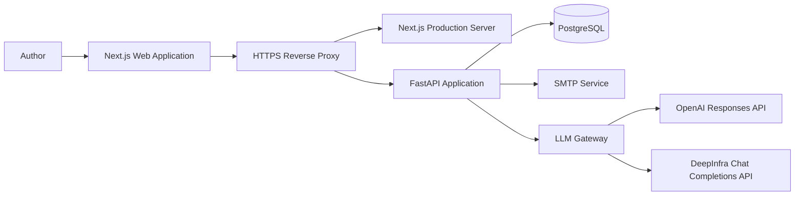
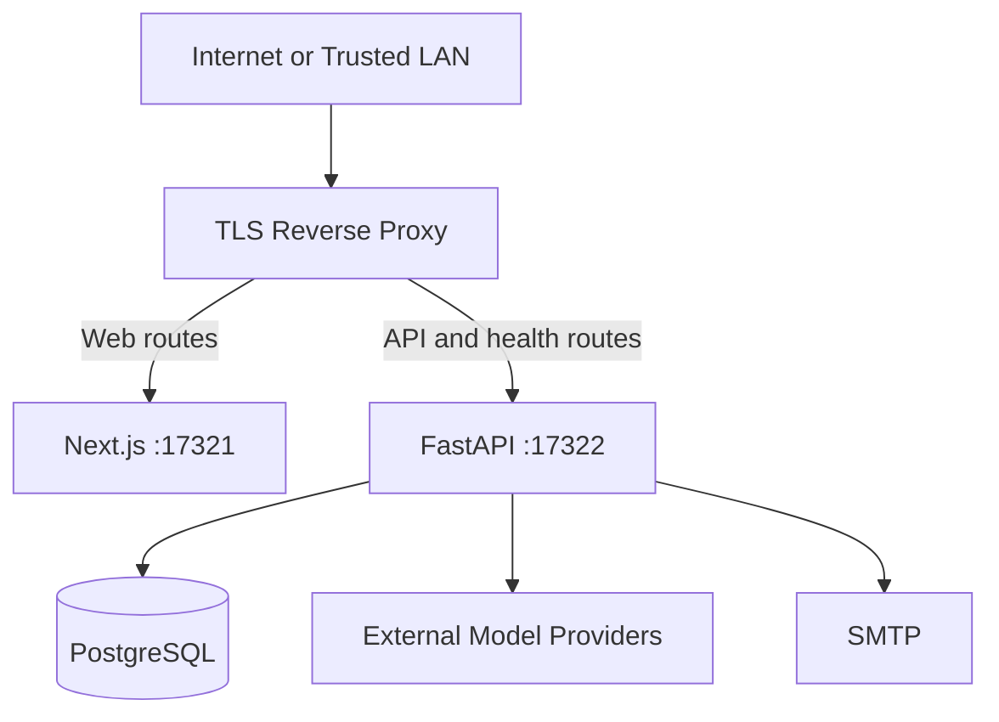
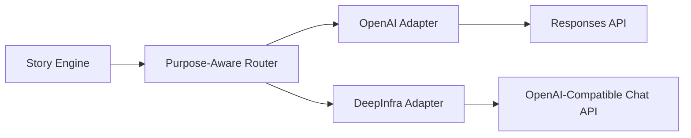
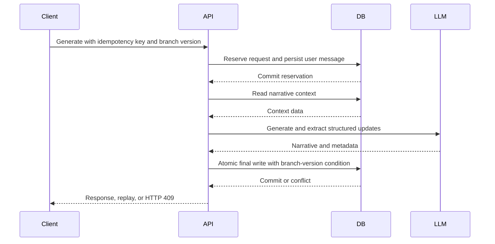

# Witscraft System Architecture

**Document status:** Production baseline

**Architecture version:** 2.0

**Last updated:** 16 August 2026

**System owner:** Witscraft Engineering

## 1. Purpose and Scope

Witscraft is an AI-assisted interactive fiction workspace. It combines persistent narrative state, branching story management, selective long-term memory, configurable model routing, and account-level privacy controls in a single production-oriented application.

This document describes the architecture implemented in the repository and identifies deliberate constraints and approved evolution paths. It is not a speculative target-state catalogue.

The architecture is guided by the following principles:

1. The application remains a modular monolith until scale or ownership boundaries justify service extraction.
2. The browser never receives model-provider credentials or direct database access.
3. PostgreSQL is the system of record for identity, narrative state, generation coordination, and audit metadata.
4. Model providers are replaceable infrastructure behind a provider-neutral gateway.
5. Deterministic application logic owns authorization, idempotency, state transitions, and persistence.
6. Expensive probabilistic operations are invoked only when they materially improve the user outcome.
7. Production releases are immutable with respect to schema: migrations are an explicit deployment step.

## 2. System Context



All browser traffic enters through the HTTPS reverse proxy. The reverse proxy routes application pages to Next.js and API paths to FastAPI. FastAPI is the sole trusted coordinator for application data and external model calls.

## 3. Deployment Topology

The current production topology uses one Next.js process, one FastAPI process, and one PostgreSQL database. The processes are supervised by the host operating system and exposed through a reverse proxy.



Production characteristics:

- The API trusts forwarded headers only from the local reverse proxy.
- CORS origins and allowed hosts are explicit allowlists.
- Authentication cookies are `Secure`, `HttpOnly`, and `SameSite=Lax`.
- Production secrets are supplied through process environment variables or `WITSCRAFT_SECRETS_FILE`.
- The production process does not read the development-only `env.md` compatibility file.
- Uvicorn receives a bounded graceful-shutdown interval and disposes the SQLAlchemy connection pool during application shutdown.

The current single-process rate limiter and model circuit breaker are intentional constraints. Both must move to shared infrastructure before horizontal API scaling is enabled.

## 4. Repository Structure

```text
Witscraft/
├── apps/
│   ├── api/
│   │   ├── app/
│   │   │   ├── db/                 # SQLAlchemy models and sessions
│   │   │   ├── llm/                # Provider adapters, routing, and call audit
│   │   │   ├── routers/            # HTTP API boundaries
│   │   │   ├── schemas/            # Pydantic request and response contracts
│   │   │   └── services/           # Narrative, auth, memory, export, and health logic
│   │   ├── migrations/              # Alembic revisions
│   │   ├── tests/                   # Unit and PostgreSQL integration tests
│   │   ├── pyproject.toml
│   │   └── uv.lock
│   └── web/
│       ├── app/                     # Next.js App Router application
│       ├── lib/                     # Typed API client and shared types
│       ├── package.json
│       └── package-lock.json
├── docs/                            # Operational and policy documentation
├── scripts/                         # Development and verification utilities
└── .github/workflows/               # Automated security gates
```

Machine-specific deployment files and live secrets are intentionally excluded from version control.

## 5. Logical Application Architecture

### 5.1 Web Application

The Next.js application provides the writing workspace, authentication views, story and branch management, model routing settings, account data export, and account deletion controls.

The current interface is implemented as a cohesive App Router workspace rather than a collection of independently deployed frontends. It communicates exclusively with the FastAPI API through the typed client in `apps/web/lib/api.ts`.

Client responsibilities include:

- rendering server-owned narrative and account state;
- generating one idempotency key for each user generation action;
- preserving the key when replaying the same HTTP request;
- sending the latest branch version with generation requests;
- consuming Server-Sent Events for streamed generation;
- presenting recoverable conflicts rather than silently overwriting state; and
- never persisting provider credentials in browser storage.

### 5.2 API Routers

FastAPI routers define four principal API areas:

| Router | Responsibility |
| --- | --- |
| `auth` | Registration, login, verification, password reset, sessions, account export, and deletion |
| `workspace` | Stories, branches, worlds, characters, memories, canon facts, preferences, summaries, and exports |
| `chat` | Context preview, regular generation, and streamed generation |
| `providers` | Model catalogue, user routing preferences, and provider health tests |

Routers perform protocol validation and authorization entry checks. Domain coordination remains in services so persistence and generation rules are not duplicated across endpoints.

### 5.3 Story Engine

The Story Engine is the primary narrative orchestrator. It coordinates context assembly, model execution, state extraction, memory preparation, consistency handling, and atomic persistence.

The engine does not grant model output authority over database identity, authorization, branch selection, or transaction control. Structured model output is validated before it can affect stored state.

### 5.4 Context and Prompt Services

Context construction is separated into deterministic stages:

1. Load the authorized story, branch, world, character, and current state.
2. Load recent messages, summaries, canon facts, preferences, and eligible memories.
3. Apply explicit section budgets using conservative token estimation.
4. Deduplicate current input and previously represented information.
5. Render a provider-neutral message sequence.

The current user message appears exactly once as the final user message. Historical and memory sections are budgeted independently so one oversized section cannot consume the complete context window.

### 5.5 LLM Gateway

The LLM Gateway provides one application-facing contract across OpenAI and DeepInfra.



The gateway owns provider-specific parameter translation, timeouts, bounded retries, error classification, purpose-specific fallback selection, process-local circuit breaking, streaming normalization, and model-call audit metadata.

Provider SDK retries are disabled. Authentication failures, invalid parameters, content rejection, and user cancellation are not retried. Streaming may retry or select a fallback only before the first visible content chunk.

### 5.6 Authentication and Authorization

Authentication uses server-side sessions. Only a one-way session-token hash is persisted. Passwords are stored using the configured password hashing implementation, and action tokens are stored in hashed form.

Every user-owned query is scoped by the authenticated user identifier. Story, branch, world, character, memory, canon fact, workspace, and export authorization boundaries are covered by PostgreSQL integration tests.

### 5.7 Health and Lifecycle Services

Health probes have distinct semantics:

| Endpoint | Meaning | External cost |
| --- | --- | --- |
| `/health/live` | The API process and event loop can respond | None |
| `/health/ready` | Required configuration, database connectivity, and migration revision are valid | One lightweight database check |
| `/health` | Backward-compatible basic health endpoint | None |

Readiness never calls a model or SMTP provider. A database failure, timeout, missing required configuration, missing Alembic version table, or revision mismatch returns HTTP `503` without exposing an internal exception.

## 6. Data Architecture

PostgreSQL is the authoritative store. The principal entity groups are:

| Group | Entities |
| --- | --- |
| Identity | `User`, `AuthCredential`, `AuthSession`, `AuthActionToken`, `AuthLoginThrottle` |
| Narrative ownership | `World`, `Character`, `Story`, `StoryBranch` |
| Narrative history | `Message`, `PlotEvent`, `StoryStateSnapshot`, `StorySummary` |
| Long-term context | `MemoryItem`, `CanonFact`, `UserPreference` |
| Generation control | `GenerationRequest` and branch version fields |
| Model operations | `UserModelRoute`, `ModelHealthCheck`, `ModelCall` |

UUIDs are used for externally referenced entities. Foreign keys and database cascades enforce ownership lifecycles, while application-level checks enforce user authorization.

Embedding values are currently stored behind a pgvector-ready boundary. A future migration will move them to fixed-dimension vector columns with model, dimension, version, content hash, and embedding timestamp metadata.

## 7. Generation and Transaction Model

Generation is divided into explicit phases to avoid holding a database write transaction while waiting for an external model.



The final transaction commits the assistant message, state snapshot, memories, canon facts, branch version, and completed generation response together. A branch-version conflict rolls back the complete final write.

Streaming partial content is checkpointed immediately and then at bounded time or character intervals. Cancellation preserves the latest stable partial and records a complete cancellation reason.

## 8. Idempotency and Concurrency

Each generation action has a durable `(user_id, idempotency_key)` identity.

- A completed request replays its stored response without another model call.
- Reuse with a different payload is rejected.
- Processing, failed, or cancelled requests do not start a duplicate generation.
- Only one generation may be processing for a branch.
- Stale generation leases are failed after the configured interval.
- Optimistic branch versions prevent stale browser tabs from overwriting newer narrative state.

These controls protect both narrative consistency and model spend.

## 9. Memory, Embeddings, and Cost Control

Embedding is selective. The system does not embed every conversational turn by default.

Embeddings are appropriate when content is accepted into long-term memory or when semantic retrieval is required. They are skipped when there are no eligible memories, when deterministic recent-context selection is sufficient, or when an identical content hash can reuse prior work.

The production direction is to hash and deduplicate content before embedding, cache query embeddings within a request, record embedding model and dimensions, prevent comparisons across incompatible embedding versions, and re-embed asynchronously during model migrations.

Multi-model routing is supported by purpose. A multi-agent architecture is not the default because narrative generation is primarily a coordinated state-transition workflow, not an open-ended autonomous task graph. Additional agents are justified only when an independently measurable task, such as evaluation or complex planning, produces sufficient quality improvement to offset latency, cost, and failure complexity.

## 10. Security and Privacy Boundaries

Production security controls include:

- fail-fast validation of database, provider, SMTP, HTTPS, cookie, CORS, and host configuration;
- explicit trusted-host and browser-origin validation;
- CSRF checks for unsafe browser requests;
- category-specific sliding-window rate limits;
- secure server-side sessions;
- structured log redaction for credentials, cookies, prompts, and sensitive query values;
- metadata-only model-call auditing;
- disabled production API documentation and debug exception output;
- disabled browser production sourcemaps and framework identification headers; and
- offline full-history secret scanning in CI.

Account export excludes password hashes, token hashes, provider secrets, SMTP credentials, and raw embedding vectors. Account deletion requires an active session, the current password, and an exact confirmation phrase before associated user data is removed.

Detailed data handling rules are defined in `docs/data-privacy.md`. Automated security gates are defined in `docs/security-checks.md`.

## 11. Model Audit and Observability

Every LLM and embedding attempt can record the provider, model, request and turn identifiers, purpose, attempt number, status, token counts, latency, optional versioned cost estimate, and sanitized error category.

Prompt and response text are not stored in `ModelCall`. Request identifiers provide correlation across application and access logs without requiring request-body logging.

The current implementation uses structured application logs and PostgreSQL audit records. OpenTelemetry-compatible traces, external metrics, and alerting remain planned operational enhancements.

## 12. Migration and Release Contract

Alembic is the only production schema migration mechanism.

The release order is:

1. Install dependencies from committed lock files.
2. Run automated tests and security gates.
3. Build the production frontend.
4. Run `alembic upgrade head` as an explicit deployment step.
5. Start or restart the application processes.
6. Require `/health/ready` to return HTTP `200`.
7. Run authenticated smoke tests and observe logs before completing the release.

Application startup does not call `create_all`, seed data, or `alembic upgrade`. Readiness rejects a deployment whose database revision does not match the migration head shipped with the application.

On `SIGTERM`, the process server stops accepting new work, waits up to the configured graceful interval for in-flight requests, and then closes the SQLAlchemy connection pool. Long-running generation remains bounded by the configured overall model timeout.

## 13. Quality Gates

The repository currently enforces or documents Python tests, Ruff checks, Alembic schema-drift checks, TypeScript type checking, ESLint, reproducible production builds, dependency vulnerability audits, full-history offline secret scanning, and production browser-artifact inspection.

Database authorization and lifecycle behavior use real PostgreSQL integration tests. Provider adapters use focused tests and controlled live validation when API expenditure is explicitly permitted.

## 14. Current Constraints and Approved Evolution

The following constraints are known and accepted for the current deployment:

- The API runs as one process; rate-limit and circuit-breaker state are process-local.
- Long-running jobs execute within request orchestration rather than a durable worker queue.
- Embedding storage has not yet migrated to fixed-dimension pgvector columns.
- Backup automation, encrypted off-site retention, and restoration drills remain P0 operational work.
- A production-equivalent staging environment has not yet been established.
- Metrics, tracing, and alerting are not yet connected to a dedicated observability platform.

Evolution should occur in this order:

1. Complete backup, restoration, staging, and release automation.
2. Establish continuous integration for the complete test matrix.
3. Introduce pgvector schema and retrieval-version controls.
4. Add durable background jobs where retries and operational visibility require them.
5. Move coordination state to shared infrastructure before adding API replicas.
6. Add specialist models or agents only after evaluation data demonstrates a net quality benefit.

## 15. Architecture Decision Summary

| Decision | Rationale |
| --- | --- |
| Modular monolith | Preserves transactional clarity and reduces operational complexity at the current scale |
| PostgreSQL system of record | Provides relational integrity, transactional generation control, and a path to pgvector |
| Provider-neutral LLM Gateway | Isolates provider parameter, streaming, retry, and error differences |
| Explicit generation ledger | Prevents duplicate narrative writes and duplicate model spend |
| Selective embeddings | Controls cost and avoids low-value vector work on every turn |
| Single orchestrator by default | Keeps authorization and state transitions deterministic and observable |
| Explicit Alembic deployment step | Prevents application startup from mutating production schema |
| Separate liveness and readiness | Distinguishes process availability from dependency and migration safety |
| Offline secret verification | Prevents suspected credentials from being transmitted to third parties |

This architecture is the production baseline for subsequent implementation and operational planning.
